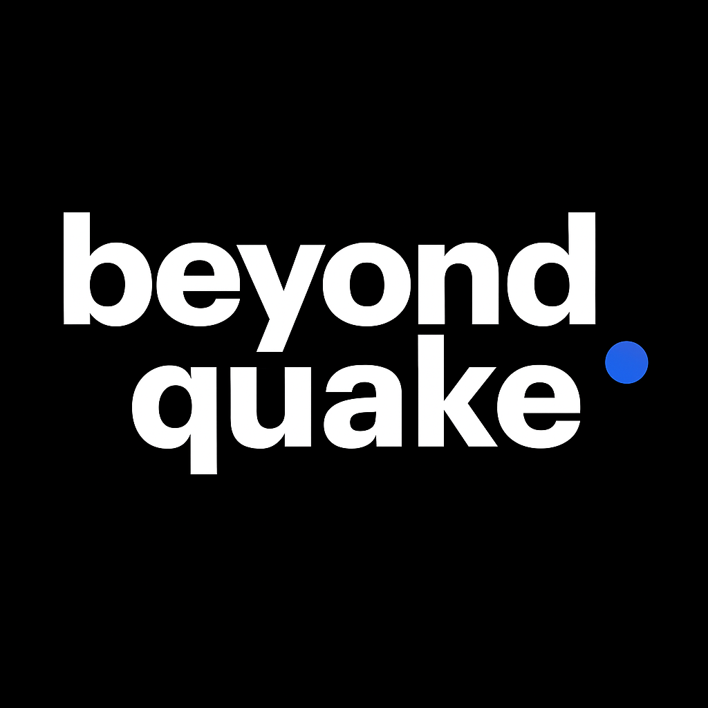

# Beyond Quake - Global Earthquake Monitoring System



A real-time monitoring system for global natural disasters that ingests earthquake data from USGS, stores it efficiently in PostgreSQL, and exposes it via a RESTful API.

## Setup

### Prerequisites
- Docker and Docker Compose
- Git

### Quick Start

1. **Clone the repository**
   ```bash
   git clone https://github.com/joao-martins-borges/beyond-quake.git
   cd beyond-quake
   ```

2. **Start the entire application**
   ```bash
   docker-compose up -d
   ```

3. **Access the API**
   - **Interactive API Docs**: http://localhost:8000/docs
   - **Alternative Docs**: http://localhost:8000/redoc
   - **OpenAPI JSON**: http://localhost:8000/openapi.json
   - **Adminer**: http://localhost:8080

### What's Running
- **FastAPI Application**: Containerized Python application with automatic USGS data ingestion
- **PostgreSQL Database**: Persistent data storage with automatic schema initialization
- **Automatic Setup**: Database tables and initial data ingestion happen automatically on startup

### Docker Commands
```bash
# Start the application
docker-compose up -d

# View logs
docker-compose logs -f

# Stop the application
docker-compose down

# Stop and remove all data (fresh start)
docker-compose down -v
```

### API Endpoints

- `GET /earthquakes` - List recent earthquakes with optional magnitude filtering
- `GET /earthquakes/{id}` - Get specific earthquake details

### Example Usage

```bash
# Get latest 10 earthquakes
curl "http://localhost:8000/earthquakes?limit=10"

# Filter by magnitude (≥5.0)
curl "http://localhost:8000/earthquakes?min_magnitude=5.0"

# Get specific earthquake
curl "http://localhost:8000/earthquakes/us7000abcd"
```

## Design Decisions

### Architecture
- **Docker-First**: Complete containerized solution requiring only Docker for deployment
- **FastAPI**: Requirement in the description (chosen due to more familiarization with Python and this framework)
- **PostgreSQL**: Required - Included dependency injection in case, in the future, we need to change the Database being used.
- **Medallion architecture concept**: We only have the 'bronze' schema currently, while we would also use the 'silver' schema with some data transformations and cleanup, and a 'gold' schema for data ready for downstream use (Machine Learning, Viz., etc.)
- **Async Processing (minimal setup concerns)**: To minimize SETUP effort, a background task for ingestion is running. It loads the previous week's data (at the time we start the application) and appends new data as it is available in the USGS API (filtered by start time and end time)

### Data Model
- **Table schema**: Included necessary fields, reutilized ID from USGS API, as well as included updated_utc field in order to keep track of changes being made to any existing earthquake record.
- **USGS ID as Primary Key**: Leverages USGS's unique identifiers for deduplication
- **Timestamp-based Ordering**: Retrieving the latest earthquakes is made by descending order of timestamp (most recent earthquakes first) while we can filter the amount of rows we want displayed (between 1 and 100).

### API Design
- **RESTful Endpoints**: Standard HTTP methods and status codes, as per requirement
- **Query Parameters**: Optional filtering by magnitude and limit of rows retrieved (default 3 rows)
- **Error Handling**: Structured error responses with appropriate HTTP status codes

### Data Ingestion
- **Data retrieval Strategy**: 2-minute intervals to prevent issues with USGS API call limit
- **Database Merge strategy**: Only ingest new/updated earthquakes based on timestamp comparison

## Assumptions

### Data Source
- USGS data format (GeoJSON) doesn't change significantly
- Earthquake data is updated within reasonable timeframes

### System Requirements
- Single-instance deployment
- PostgreSQL database can handle the expected data volume
- Network connectivity to USGS API is reliable

### Business Logic
- "Latest earthquakes" means most recent by event timestamp
- No authentication/authorization required for public earthquake data
- Real-time means "near real-time" so we can use 2-minute intervals

### Data Quality
- USGS provides accurate and complete earthquake data
- Personalized data quality would be developed further on in the medallion architecture of the data model - 'silver' layer for cleanup and metric creation - 'gold' layer for downstream usage.

## Limitations

### Scalability
- **Single-threaded ingestion**: Background task runs on single process
- **Database bottleneck**: Single PostgreSQL instance without read replicas

### Performance
- **No caching**: Every API request hits the database

### Monitoring & Observability
- **Basic logging**: Simple console logging without structured logging
- **No metrics**: No application performance monitoring

### Error Handling
- **Exponential backoff**: Could use a mechanism to limit API call rates
- **Basic error messages**: Generic error messages without detailed diagnostics

### Data Management
- **No data retention policy**: No automatic cleanup of old data
- **No backup strategy**: No automated database backups
- **No data migration**: No versioning or schema evolution support

---

**Note**: This system is designed as a proof-of-concept for the Beyond Gravity case study. Production deployment would require addressing all the limitations.